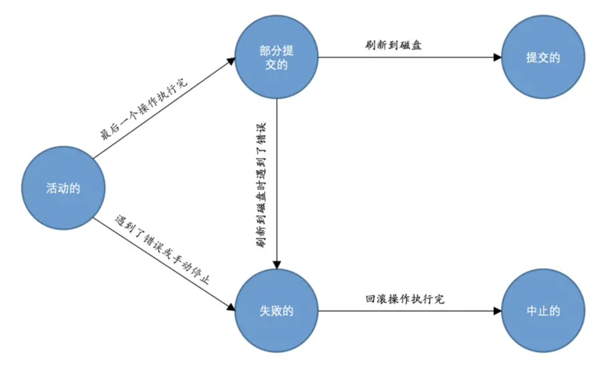

# 事务的 ACID 特性

## 原子性（atomicity）

一个事务必须被视为一个不可分割的工作单元，整个事务中的所有操作要么全部操作成功，要么全部失败回滚

## 一致性（consistency）

数据库总是从一个一致性状态转换到下一个一致性状态

## 隔离性（isolation）

两次状态转换操作互不影响。通常来说，一个事务所做的修改在最终提交以前，对其他事务都是不可见的

## 持久性（durability）

一旦提交，事务所做的修改就会被永久保存到数据库中。即使系统崩溃，数据也不会丢失

# 事务的状态转换

# 事务的隔离级别

## 读未提交（read uncommitted）

在事务中可以查看其它事务中还没有提交的修改

## 读已提交（read committed，简称RC）

一个事务可以看到其它事务在它开始之后提交的修改，但在事务提交之前，其所做的任何修改对其他事务都是不可见的

## 可重复读（repeatable read，简称RR）

在同一个事务中多次读取相同行的数据的结果是一样的

## 可串行化（serializable）

强制事务按序执行

# 事务并发执行遇到的问题

| 隔离级别         | 脏读     | 不可重复读 | 幻读     |
| ---------------- | -------- | ---------- | -------- |
| read uncommitted | &#10003; | &#10003;   | &#10003; |
| read committed   | &#10005; | &#10003;   | &#10003; |
| repeatable read  | &#10005; | &#10005;   | &#10003; |
| serializable     | &#10005; | &#10005;   | &#10005; |

## 脏读

一个事务读取到了另一个事务未提交的数据

## 不可重复读

同一个事务两次执行相同语句，可能会看到不同的数据结果

## 幻读

一个事务在读取某个范围内的记录时，读取到了另一个事务在该范围内插入的新的记录

# MVCC（Multi-Version Concurrency Control，多版本并发控制）

MVCC 是通过ReadView + Undo Log 来实现的，undo log 通过roll_pointer 指针形成了版本链，而 ReadView用来判断版本链中的哪个版本是当前事务可见的

## 版本链

聚簇索引记录包含两个必要的隐藏列：

* trx_id：每次一个事务对某条聚簇索引记录进行改动时，都会把该事务的事务 id 赋值给 trx_id 隐藏列
* roll_pointer：每次对某条聚簇索引记录进行改动时，都会把旧的版本写入到 undo 日志中，然后这个隐藏列就相当于一个指针，可以通过它来找到该记录修改前的信息

## ReadView

ReadView 包含 4 个比较重要的内容：

* m_ids：表示在生成 ReadView 时当前系统中活跃的读写事务的事务 id 列表
* min_trx_id：表示在生成 ReadView 时当前系统中活跃的读写事务中最小的事务 id，也就是 m_ids 中的最小值
* max_trx_id：表示生成 ReadView 时系统中应该分配给下一个事务的 id 值
* creator_trx_id：表示生成该 ReadView 的事务的事务 id

生成时机：

* read committed：每次读取数据前都生成一个 ReadView
* repeatable read：只在第一次读取数据时生成一个 ReadView

## 可见性判断

判断某个版本是否可见步骤：

1. 如果被访问版本的 trx_id 属性值与 ReadView 中的 creator_trx_id 值相同，意味着当前事务在访问它自己修改过的记录，所以该版本可以被当前事务访问

2. 如果被访问版本的 trx_id 属性值小于 ReadView 中的 min_trx_id 值，表明生成该版本的事务在当前事务生成 ReadView 前已经提交，所以该版本可以被当前事务访问

3. 如果被访问版本的 trx_id 属性值大于或等于 ReadView 中的 max_trx_id值，表明生成该版本的事务在当前事务生成 ReadView 后才开启，所以该版本不可以被当前事务访问

4. 如果被访问版本的 trx_id 属性值在 ReadView 的 min_trx_id 和 max_trx_id 之间，那就需要判断一下 trx_id 属性值是不是在 m_ids 列表中，如果在，说明创建 ReadView 时生成该版本的事务还是活跃的，该版本不可以被访问；如果不在，说明创建 ReadView 时生成该版本的事务已经被提交，该版本可以被访问

如果某个版本的数据对当前事务不可见的话，那就顺着版本链找到下一个版本的数据，继续按照上边的步骤判断可见性，依此类推，直到版本链中的最后一个版本。如果最后一个版本也不可见的话，那么就意味着该条记录对该事务完全不可见，查询结果就不包含该记录

