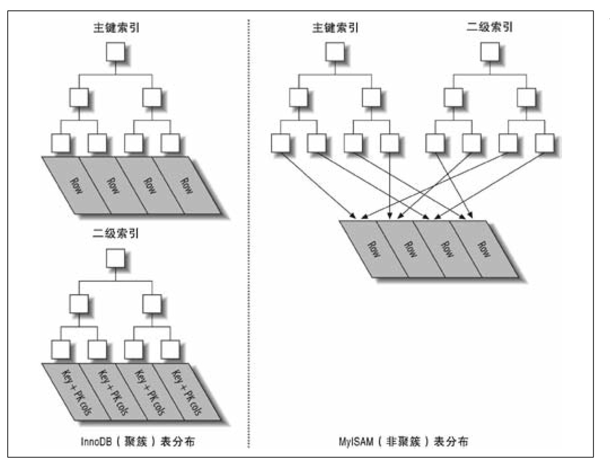

# 索引


## InnoDB 和 MyISAM 索引



### InnoDB 引擎

主键索引（聚簇索引）：索引即数据，叶子节点存储完整的用户记录（包括隐藏列），非叶子节点存储主键+页号

二级索引：叶子节点存储索引列+主键，非叶子节点存储索引列+页号


### MyISAM 引擎

主键索引：索引和数据分开存储，叶子节点存储了主键+行号（指向实际数据所在的物理位置），非叶子节点存储主键+页号

二级索引：叶子节点存储了索引列+行号，非叶子节点存储索引列+页号


## 索引查找原理

数据页通过 **FIL_PAGE_PREV（上一个页的页号）** 和 **FIL_PAGE_NEXT（下一个页的页号）** 组成双向链表

记录通过 **next_record（下一条记录的相对位置）** 组成单向链表

页目录中的槽存储分组中最大记录的地址偏移量

索引页中的目录项存储下一级数据页中记录的最小索引列值和页号


**索引查找步骤：**

1. 通过 B+ 树定位到记录所在的页
2. 在页目录中通过二分法确定该记录所在的槽
3. 通过记录的 **next_record** 属性遍历该槽所在的组中的各个记录


## Server 层和存储引擎的交互

以二级索引为例：

1. server 层先让 InnoDB 去查二级索引列在扫描区间的第一条记录
1. InnoDB 通过二级索引对应的 B+ 树，从 B+ 树根节点页面一层一层向下定位，快速找到扫描区间的第一条二级索引记录，然后回表找到完整的聚簇索引记录返回给 server 层
1. server 层判断 InnoDB 返回的记录符不符合搜索条件，如果不符合的话就跳过该记录，否则将其发送到客户端
1. server 层向 InnoDB 要下一条记录
1. InnoDB 根据上一次找到的二级索引的 next_record 属性，获取到下一条二级索引记录，回表后将完整的聚集索引记录返回给 server 层
1. server 层继续判断，不符合搜索条件就跳过该记录，否则将其发送到客户端
1. 一直循环上述过程，直到 InnoDB 找不到下一条记录，则向 server 层报告查询完毕
1. server 层收到 InnoDB 报告的查询完毕请求，停止查询

一般情况下，server 层和存储引擎层是以记录为单位进行交互的


## B+ 树索引生成原理（从下到上）

每当为表创建 B+ 树索引的时候，首先会创建一个根节点页面，随后向根节点页面插入用户记录。当根节点页面的可用空间用完后，此时会将根节点页面中的所有记录复制到一个新分配的页中，然后对这个新页进行页分裂的操作，得到另一个新页，再把新插入的记录放到两个新页之一中，根节点页面升级为存储目录项纪录的页。这就保证了 B+ 树索引的根节点页号是固定的，不会随着记录的插入而改变


## B+ 树索引最多存储的数据量（估算）

一个页大小是 16KB，假设一条记录大小为 1KB，那么一个页可以存储 16 条数据，记录的主键索引大小为 16B，那么一个页可以存储 1000 条数据

聚簇索引叶子节点存储记录，非叶子节点存储主键索引

一层 B+ 树：16

二层 B+ 树：16 * 1000 = 16 000

三层 B+ 树：16 * 1000 * 1000 = 16 000 000

四层 B+ 树：16 * 1000 * 1000 * 1000 = 16 000 000 000

所以，一般情况下，B+ 树不会超过四层


## B+ 树索引适用场景

* 全值匹配
* 匹配范围值
* 联合索引匹配左边的列或等值匹配前一列并范围匹配另外一列
* 匹配列前缀
* 用于排序（避免文件排序）
* 用于分组


## 如何挑选索引

* 为用于搜索、排序或分组的列创建索引
* 尽量选择基数（cardinality）大的列，不重复的索引值和数据表的记录总数的比值越大区分度越高
* 尽量使用覆盖索引，避免回表


## 索引的代价

### 空间上的代价

一个索引对应一棵 B+ 树，B+ 树的每一个节点都是一个数据页，一个页默认会占用 16KB 的存储空间


### 时间上的代价

B+ 树每层节点中的记录都是按照索引列的值从小到大的顺序排序的，而增、删、改操作可能会对节点和记录的排序造成破坏，所以存储引擎需要额外的时间进行一些记录移位、页面分裂、页面回收等的操作维护节点和记录的排序


### 回表的代价

访问二级索引使用顺序 I/O，回表访问聚簇索引使用随机 I/O

二级索引查询出来的主键值可能并不相连，根据这些不连续的主键值到聚簇索引中访问完整的用户记录可能分布在不同的数据页中，这种读取方式称为随机 I/O


## 不走索引的场景

* 不遵循最左匹配原则（联合索引、列前缀）
* 索引列存在函数或表达式
* 字符编码不匹配
* 存在隐式类型转换（字符串和数字进行比较，MySQL 会自动把字符串转换为数字，在进行比较）
* OR 前的条件是索引列，OR 后的条件不是索引列


## COUNT() 函数优化

count(*)、count(常数) 表示的是查询符合条件的数据库表的行数

count(列名) 表示的是查询符合条件的列的值不为 NULL 的行数


对于 count(*)、count(常数) 来说，读取哪个索引的记录其实并不重要，因为 server 层只关心存储引擎是否读到了记录，而并不需要从记录中提取指定的字段来判断是否为 NULL。所以优化器会使用占用存储空间最小的那个索引来执行查询

对于 count(主键) 来说，由于列名是主键，不论是聚簇索引记录，还是任意一个二级索引记录中都会包含主键字段，所以其实读取任意一个索引中的记录都可以获取到主键字段，此时优化器也会选择占用存储空间最小的那个索引来执行查询

对于 count(非主键列) 来说，server 层必须要从 InnoDB 中读取包含非主键列的记录，而我们指定的列可能并不会包含在每一个索引中，就可能导致优化器选择的索引不是最小的那个


 count(\*)、count(常数)、count(主键) 这三个函数可以粗略的认为所需要的代价是相同的，但是 count(\*) 是 SQL92 定义的标准统计行数的语法，MySQL 对它做过很多优化，所以尽量采用 count(\*) 来统计行数


## limit 深度分页优化

select * from t order by key1 limit 5000, 1 的执行过程：

1. server 层向 InnoDB 要第一条记录，InnoDB 从 idx_key1 中获取到第一条二级索引记录，然后进行回表操作得到完整的聚簇索引记录，返回给 server 层。这时 server 层发现还有个 limit 5000,1 的条件，意味着符合条件的记录中的第 5001 条数据才可以发送给客户端，所以这里只是先做个统计，并不会把数据发送给客户端
2. server 层再向 InnoDB 要下一条记录，InnoDB 再根据二级索引记录的 next_record 属性找到下一条二级索引记录，再次进行回表得到完整的聚簇索引记录返回给 server 层
3. 重复上述操作
4. 直到第 5001 条记录的时候，server 层才会真正的将 InnoDB返回的完整聚簇索引记录发送给客户端

因为 MySQL 是在实际向客户端发送记录前才会去判断 limit 子句是否符合要求，所以如果使用二级索引执行查询的话，意味着要进行 5001 次回表操作，代价太大，还不如全表扫描+filesort


### 优化手段

#### 延迟连接（减少回表次数）

```
select t.* 
from t inner join (
	select id from t order by key1 limit 5000,1
) as d on t.id = d.id
```


#### 范围查询（基于ID排序且ID 单调递增）

```
select t.*
from t
where id > (
	select id from t order by id limit 5000,1
)
order by id
limit 1
```


## 同一个表中查询和更新

例如：将表中每一行的 c 字段值更新为和该行的 type 字段值相同的行数量

```mysql
update tbl as outer_tbl
set c = (
	select count(*) from tbl as inner_tbl
	where inner_tbl.type = outer_tbl.type
);

ERROR 1093 (HY000): You can't specify target table 'outer_tbl' for update in from clause
```

**解决方法：**

```mysql
update tbl
inner join (
	select type, count(*) as c
  from tbl
  group by type
) as der using(type)
set tbl.c = der.c;
```

MySQL 不允许对一张表同时进行查询和更新，但是可以通过使用生成表的形式来绕过上面的限制，因为 MySQL 只会把这个表当作一个临时表来处理


