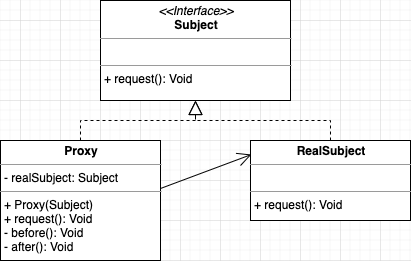

# 设计模式详解

## 面向对象设计

面向对象设计主要分为四个步骤：

1. 根据需求设计需要的类
2. 确定类中的属性和方法，确定属性一般根据需求分析中的名称，确定方法一般根据需求分析中的动词
3. 确定类与类之间的关系，这些关系一般包括：泛化（继承）、实现、组合、依赖
4. 将类封装起来并提供执行的入口，这个入口可能是一个 main() 函数，也可能是一组给外部用的 API 接口


## UML 类图


类图分三层，第一层是类的名称，如果是抽象类，则用斜体显示；第二层是类的特性，通常就是字段和属性。第三层是类的操作，通常是方法或行为。注意前面的符号，‘+’ 表示 public，‘-’ 表示 private，‘#’ 表示 protected

接口图分两层，第一层是接口名称，与类图区别是顶端有 <<interface\>> 显示；第二层是接口方法


抽象类名和抽象方法名用斜体表示

静态属性和方法用下划线表示


泛化（继承）关系用空心三角形+实线表示

实现关系用空心三角形+虚线表示


关联关系用实线箭头表示，是一种非常弱的关系，包含聚合、组合两种关系。如果 B 类对象是 A 类的成员变量，那么 B 类和 A 类就是关联关系

聚合关系用空心菱形+实线箭头表示，是一种弱的关系，A 类对象包含 B 类对象，B 类对象的生命周期可以不依赖 A 类对象的生命周期，也就是说可以单独销毁 A 类对象而不影响 B 类对象

合成（组合）关系用实心菱形+实线箭头表示，是一种强的关系，A 类对象包含 B 类对象，B 类对象的生命周期依赖 A 类对象的生命周期，B 类对象不可单独存在

依赖关系用虚线箭头表示，是一种比关联关系更加弱的关系，包含关联关系，不管是 B 类对象是 A类的成员变量，还是 A 类的方法使用 B 类的对象作为参数或者返回值、局部变量，只要 B 类对象和 A 类对象有任何使用关系，我们都成它们有依赖关系

关系由弱到强依次是：依赖 < 关联 < 聚合 < 合成（组合）

关联关系、聚合关系、合成（组合）关系的连线两端可以存在数字，这被称为基数。表明这一端的类可以有几个实例，如果一个类可能有无数个实例，则用 n 表示


聚合示例代码

```java
public class A {
  private B b;
  public A(B b) {
    this.b = b;
  }
}
```

合成（组合）示例代码

```java
public class A {
  private B b;
  public A() {
    this.b = new B();
  }
}
```


## 设计原则

SOLID（solid，稳定的）：

* Single Responsibility Principle：单一职责原则
* Open Closed Principle：开闭原则
* Liskov Substitution Principle：里氏替换原则
* Law of Demeter：迪米特法则
* Interface Segregation Principle：接口隔离原则
* Dependence Inversion Principle：依赖倒置原则


### 单一职责原则

单一职责原则的定义是：应该有且仅有一个原因引起类的变更，强调的是职责的分离，一个类只需要负责一种职责即可

建议是接口一定要做到单一职责，类的设计尽量做到只有一个原因引起变化


### 开闭原则

开闭原则的定义是：对扩展开放，对修改关闭

建议是想要修改一个功能，请不要直接进行内部的代码修改，而是使用扩展的方式进行


### 里氏替换原则

里氏替换原则定义是：子类对象能够替换程序中父类对象出现的任何地方，并且保证原来程序的逻辑行为不变及正确性不被破坏

建议是在类中调用其他类时务必要使用父类或接口，如果不能使用父类或接口，则说明类的设计已经违背了里氏替换原则


### 迪米特法则

迪米特法则又称最少知识原则，定义是：一个类应该对自己需要耦合或调用的类知道得越少越好

建议是尽量不要对外公布太多的 public 方法和非静态的 public 变量，多使用 private、default、protected等访问权限


### 接口隔离原则

接口隔离原则的定义是：客户端不应该依赖它不需要的接口

接口隔离原则提供了一种判断接口的职责是否单一的标准：通过调用者如何使用接口来间接地判定。如果调用者只使用部分接口或接口的部分功能，那接口的设计就不够职责单一

建议是不要使用没有依赖关系的接口。根据接口隔离原则拆分接口时，首先必须满足单一职责原则，然后在接口中尽量少公布 public 方法


### 依赖倒置原则

依赖倒置原则定义是：程序要依赖于抽象接口，不要依赖于具体实现

建议是面向接口编程


### 合成复用原则

合成复用原则定义是：在代码复用时，优先使用组合或聚合等关联关系来实现，其次才考虑使用继承关系来实现


## 设计思想


## 设计模式

设计模式分为三类：创建型、结构型、行为型。创建型模式主要解决”对象的创建“问题，结构型模式主要解决”类或对象的组合或组装“问题，行为型模式主要解决的是”类或对象之间的交互“问题

设计模式的主要目的是解耦，创建型模式是将创建和使用代码解耦，结构型模式是将不同功能代码解耦，行为型模式是将不同的行为代码解耦

每个设计模式都应该由两部分组成：第一部分是应用场景，即这个模式可以解决哪类问题；第二部分是解决方案，即这个模式的设计思路和具体的代码实现。设计模式之间的主要区别还是在于设计意图，也就是应用场景


### 创建型模式

创建类模式包括单例模式、工厂方法模式、抽象工厂模式、建造者模式和原型模式，它们都能够提供对象的创建和管理职责。其中单例模式是要保证在内存中只有一个对象，原型模式是要求通过复制的方式产生一个新的对象


#### 单例模式

##### 定义

保证一个类只有一个实例，并提供一个访问该实例的全局节点

##### 类图


##### 通用源码

```java
// 懒汉
public class Singleton {
    private static Singleton instance;
    private Singleton() {}
    public static synchronized Singleton getInstance() {
        if (instance == null) {
            instance = new Singleton();
        }
        return instance;
    }
}

// 双重检查锁
public class Singleton {
    private volatile static Singleton singleton;
    private Singleton() {}
    public static Singleton getIntance() {
        if (singleton == null) {
            synchronized (Singleton.class) {
                if (singleton == null) {
                    singleton = new Singleton();
                }
            }
        }
        return singleton;
    }
}

// 饿汉
public class Singleton {
    private static Singleton instance = new Singleton();
    private Singleton() {}
    public static Singleton getInstance() {
        return instance;
    }
}

public class Singleton {
    private static Singleton instance;
    static {
        instance = new Singleton();
    }
    private Singleton() {}
    public static Singleton getInstance() {
        return instance;
    }
}

// 静态内部类
public class Singleton {
    private static class SingletonHolder {
        private static Singleton instance = new Singleton();
    }
    private Singleton() {}
    public static Singleton getInstance() {
        return SingletonHolder.instance;
    }
}

// 枚举
public enum Singleton {
    INSTANCE;
}

// CAS
public class Singleton {
    private static AtomicReference<Singleton> atomicReference = new AtomicReference<>();
    private Singleton() {}
    public static Singleton getInstance() {
        while(true) {
            Singleton instance = atomicReference.get();
            if (instance != null) {
                return instance;
            }
            instance = new Singleton();
            if (atomicReference.compareAndSet(null, instance)) {
                return instance;
            }
        }
    }
}
```

##### 应用场景

要求一个类有且仅有一个对象


#### 工厂方法模式

##### 定义

定义一个用于创建对象的接口，让子类决定实例化哪一个类。工厂方法使一个类的实例化延迟到其子类

##### 类图


##### 通用源码

```java
public abstract class Creator {
    public abstract Product createProduct();
}

public class ConcreteCreatorA extends Creator {
    @Override
    public Product createProduct() {
        return new ConcreteProductA();
    }
}

public class ConcreteCreatorB extends Creator {
    @Override
    public Product createProduct() {
        return new ConcreteProductB();
    }
}

// 并不一定每次调用工厂方法都会创建新的实例，工厂方法也可以返回缓存、对象池或其他来源的已有对象
```

##### 应用场景

工厂方法模式是 new 一个对象的替代品，所以在需要创建对象的地方都可以使用


#### 抽象工厂模式

##### 定义

为创建一组相关或相互依赖的对象提供一个接口，而且无需指定它们的具体类

##### 类图


##### 通用源码

```java
public interface Factory {
    ProductA createProductA();
    ProductB createProductB();
}

public class ConcreteFactory1 implements Factory {
    @Override
    public ProductA createProductA() {
        return new ConcreteProductA1();
    }

    @Override
    public ProductB createProductB() {
        return new ConcreteProductB1();
    }
}

public class ConcreteFactory2 implements Factory {
    @Override
    public ProductA createProductA() {
        return new ConcreteProductA2();
    }

    @Override
    public ProductB createProductB() {
        return new ConcreteProductB2();
    }
}
```

##### 应用场景

多个业务品种、业务种类时，可以使用抽象工厂模式产生需要的对象


#### 简单工厂、工厂方法、抽象工厂三者的区别

简单工厂是一个工厂方法创建所有具体产品

工厂方法是一个工厂方法只创建一个具体产品

抽象工厂是一个工厂方法只创建一类具体产品


#### 建造者模式

##### 定义

将一个复杂对象的构建与它的表示分离，使得同样的构建过程可以创建不同的表示

##### 类图


##### 通用源码

```java
public abstract class Builder {
    public abstract void setPart();
    public abstract Product getResult();
}

public class ConcreteBuilder extends Builder {
    private Product product = new Product();

    @Override
    public void setPart() {

    }

    @Override
    public Product getResult() {
        return product;
    }
}

public class Director {
    private Builder builder = new ConcreteBuilder();
    public Product construct() {
        builder.setPart();
        return builder.getResult();
    }
}
```

##### 应用场景

下面三种情况之一，要考虑使用建造者模式：

* 我们把类的必填属性放到构造函数中，强制创建对象的时候就设置。如果必填的属性有很多，把这些必填属性都放到构造函数中设置，那构造函数就又会出现参数列表很长的问题。如果我们把必填属性通过 set() 方法设置，那校验这些必填属性是否已经填写的逻辑就无处安放了
* 如果类的属性之间有一定的依赖关系或者约束条件，我们继续使用构造函数配合 set() 方法的设计思路，那这些依赖关系或约束条件的校验逻辑就无处安放了
* 如果我们希望创建不可变对象，也就是说，对象在创建好之后，就不能再修改内部的属性值，要实现这个功能，我们就不能在类中暴露 set() 方法。构造函数配合 set() 方法设置属性值的方式就不适用了


#### 工厂模式和建造者模式的区别

工厂模式注重的是整体对象的创建方法，而建造者模式注重的是部件构建的过程


#### 原型模式

##### 定义

用原型实例指定创建对象的种类，并且通过拷贝这些原型创建新的对象

##### 类图


##### 通用源码

```java
public class PrototypeClass implements Cloneable {
    @Override
    protected PrototypeClass clone() {
        PrototypeClass prototypeClass;
        try {
            prototypeClass = (PrototypeClass) super.clone();
        } catch (CloneNotSupportedException e) {
            throw new RuntimeException(e);
        }
        return prototypeClass;
    }
}

// Cloneable 接口一个方法也没有，只是起到一个标记作用，具有这个标记才可能被拷贝；从可能被拷贝到可以被拷贝，需要重写 Object 类中的 clone() 方法

// Object 类的 clone() 方法的构造函数不会被执行，复制原理是从内存中（具体来说就是堆内存）以二进制的方式进行拷贝，重新分配一块内存空间
```

##### 应用场景

用在需要复制对象的场景。要使用 clone() 方法，类的成员变量上不要增加 final 关键字


#### 深拷贝和浅拷贝

浅拷贝只会复制对象中基本数据类型数据（String类型也会复制）和引用对象的内存地址，不会递归地复制引用对象，以及引用对象的引用对象

深拷贝得到的是一个完完全全新的对象


**实现深拷贝的方式：**

1. 递归遍历对象、对象的引用对象以及引用对象的引用对象，直到要拷贝的对象只包含基本数据类型数据，没有引用对象为止
2. 先将对象序列化，然后再反序列化成新的对象


### 结构型模式

结构类模式包括适配器模式、桥梁模式、组合模式、装饰模式、门面模式、享元模式和代理模式。

它们都是通过组合类或对象产生更大结构以适应更高层次的逻辑需求


#### 代理模式

##### 定义

为其他对象提供一种代理以控制对这个对象的访问

##### 类图



##### 通用源码

```java
public class Proxy implements Subject {
    private Subject subject;

    public Proxy(Subject subject) {
        this.subject = subject;
    }

    @Override
    public void request() {
        this.before();
        this.subject.request();
        this.after();
    }

    public void before() {}
    public void after() {}
}
```

##### 应用场景

常用在业务系统中开发一些非功能性需求，比如：日志、鉴权、事务、RPC、缓存等


#### 动态代理

动态代理的优势不在于省去了编写代理类的那一点工作量，而是实现了可以在原始类和接口还未知的时候，就确定了代理类的行为。当代理类与原始类脱离联系后，就可以很灵活的重用于不同的场景之中

##### 示例

```java
public class DynamicProxy {
    private class DynamicProxyHandler implements InvocationHandler {
        private Object proxiedObject;

        public DynamicProxyHandler(Object proxiedObject) {
            this.proxiedObject = proxiedObject;
        }

        @Override
        public Object invoke(Object proxy, Method method, Object[] args) throws Throwable {
            return method.invoke(this.proxiedObject, args);
        }
    }
    
    public Object createProxy(Object proxiedObject) {
        ClassLoader classLoader = proxiedObject.getClass().getClassLoader();
        Class<?>[] interfaces = proxiedObject.getClass().getInterfaces();
        InvocationHandler invocationHandler = new DynamicProxyHandler(proxiedObject);
        return Proxy.newProxyInstance(classLoader, interfaces, invocationHandler);
    }
}
```

##### JDK 动态代理和 CGLIB 动态代理区别

JDK 动态代理是委托机制，代理类和被代理类都实现了同样的接口，要求被代理类必须实现一个接口

CGLIB 动态代理是继承机制，代理类是被代理类的子类，要求被代理类不能使用 final 修饰


#### 桥接模式

##### 定义

将抽象和实现解耦，使得两者可以独立地变化

定义中的”抽象“，指的并非”抽象类“或”接口“，而是被抽象出来的一套”类库“，它只包含骨架代码，真正的业务逻辑需要委派给定义中的”实现“来完成。而定义中的”实现“，也并非”接口的实现类“，而是一套独立的”类库“。”抽象“和”实现“独立开发，通过对象之间的组合关系，组装在一起

##### 类图


##### 通用源码

```java
public abstract class Abstraction {
    private Implementor implementor;

    public Abstraction(Implementor implementor) {
        this.implementor = implementor;
    }

    public Implementor getImplementor() {
        return implementor;
    }

    public void function() {
        this.implementor.implementation();
    }
}
```

##### 应用场景

继承层级较多时，可以考虑使用桥接模式


#### 装饰模式

##### 定义

动态地给一个对象添加一些额外的职责。就增加功能来说，装饰模式相比生成子类更为灵活

##### 类图


##### 通用源码

```java
public interface Component {
    void operate();
}

public abstract class Decorator implements Component {
    private Component component;

    public Decorator(Component component) {
        this.component = component;
    }

    @Override
    public void operate() {
        this.component.operate();
    }
}

public class ConcreteDecorator extends Decorator {
    public ConcreteDecorator(Component component) {
        super(component);
    }

    @Override
    public void operate() {
        super.operate();
        this.extra();
    }

    private void extra() {}
}
```

##### 应用场景

装饰模式主要解决继承关系过于复杂的问题，通过组合来替代继承。它主要的作用是给原始类添加增强功能，这也是判断是否该用装饰模式的一个重要的依据。装饰模式可以对原始类嵌套使用多个装饰类


#### 适配器模式

##### 定义

将一个类的接口变换成客户端所期待的另一种接口，从而使原本因接口不匹配而无法在一起工作的两个类能够在一起工作

##### 类图

 

##### 通用源码

```java
public interface Target {
    void request();
}

public class Adaptee {
    public void doSomething() {}
}

// 类适配器
public class Adapter1 extends Adaptee implements Target {
    @Override
    public void request() {
        super.doSomething();
    }
}

// 对象适配器
public class Adapter2 implements Target {
    private Adaptee adaptee;

    public Adapter2(Adaptee adaptee) {
        this.adaptee = adaptee;
    }

    @Override
    public void request() {
        adaptee.doSomething();
    }
}

// 适配器模式有两种实现方式：类适配器和对象适配器。其中，类适配器使用继承关系来实现，对象适配器使用组合关系来实现
```

##### 应用场景

适配器模式的应用场景是”接口不兼容“，可以看作一种”补偿模式“，用来补救设计上的缺陷。通常用在修改一个已经投产中的接口


#### 代理、桥接、装饰、适配器模式四种设计模式的区别

**相同点：**

代理、桥接、装饰、适配器，这四种模式是比较常用的结构型设计模式。它们的代码结构非常相似。笼统来说，它们都可以称为 Wrapper 模式，也就是通过 Wrapper 类二次封装原始类

**区别：**

代理模式：代理模式在不改变原始类接口的条件下，为原始类定义一个代理类，主要目的是控制访问，而非加强功能，这是它跟装饰模式最大的不同

桥接模式：桥接模式的目的是将接口部分和实现部分分离，从而让它们可以较为容易、也相对独立地加以改变

装饰模式：装饰模式在不改变原始类接口的情况下，对原始类功能进行增强，并且支持多个装饰类的嵌套使用

适配器模式：适配器模式是一种事后的补救策略。适配器提供跟原始类不同的接口，而代理模式、装饰模式提供的是跟原始类相同的接口


#### 门面模式

##### 定义

门面模式为子系统提供一组统一的接口，定义一组高层接口让子系统更易用

##### 类图


##### 通用源码

```java
public class ClassA {
    public void doSomethingA() {}
}

public class ClassB {
    public void doSomethingB() {}
}

public class Facade {
    private ClassA classA = new ClassA();
    private ClassB classB = new ClassB();

    public void doSomethingA() {
        this.classA.doSomethingA();
    }

    public void doSomethingB() {
        this.classB.doSomethingB();
    }
}

// 门面不参与子系统内的业务逻辑，可以建立一个封装类，封装完毕后提供给门面对象
```

##### 应用场景

需要为一个复杂的模块或子系统提供一个供外界访问的接口


#### 组合模式

##### 定义

将一组对象组织成树形结构，以表示一种”部分 - 整体“的层次结构。组合让客户端可以统一单个对象和组合对象的处理逻辑

##### 类图


##### 通用源码

```java
public interface Component {
    void doSomething();
}

public class Composite implements Component {
    private List<Component> componentList = new ArrayList<>();

    public void add(Component component) {
        this.componentList.add(component);
    }

    public void remove(Component component) {
        this.componentList.remove(component);
    }

    public List<Component> getChildren() {
        return this.componentList;
    }

    @Override
    public void doSomething() {}
}

public class Leaf implements Component {
    @Override
    public void doSomething() {}
}
```

##### 应用场景

组合模式主要用在数据能表示成树形结构、能通过树的遍历算法来解决的场景中。例如目录、子目录和文件结构或者部门、子部门和员工结构


#### 享元模式

##### 定义

使用共享对象可有效地支持大量细粒度的对象

##### 类图


##### 通用源码

```java
public abstract class Flyweight {
    private String intrinsic;
    protected String extrinsic;

    public Flyweight(String extrinsic) {
        this.extrinsic = extrinsic;
    }

    public String getIntrinsic() {
        return intrinsic;
    }

    public void setIntrinsic(String intrinsic) {
        this.intrinsic = intrinsic;
    }

    public abstract void operate();
}

public class ConcreteFlyweight extends Flyweight {

    public ConcreteFlyweight(String extrinsic) {
        super(extrinsic);
    }

    @Override
    public void operate() {}
}

public class FlyweightFactory {
    private static Map<String, Flyweight> pool = new HashMap<>();

    public static Flyweight getFlyweight(String extrinsic) {
        Flyweight flyweight;
        if (pool.containsKey(extrinsic)) {
            flyweight = pool.get(extrinsic);
        } else {
            flyweight = new ConcreteFlyweight(extrinsic);
            pool.put(extrinsic, flyweight);
        }
        return flyweight;
    }
}
```

##### 应用场景

仅在程序必须支持大量对象且没有足够的内存容量时使用享元模式


#### 享元模式、单例、缓存、对象池之间的区别

在单例模式中，一个类只能创建一个对象，而在享元模式中，一个类可以创建多个对象，每个对象被多处代码引用共享

享元模式中的缓存实际上是存储的意思，而我们平时说的缓存是为了提高访问效率，而非复用

池化技术中的复用是在任意时刻，每一个对象、连接、线程，并不会被多处使用，而是被一个使用者独占，当使用完成之后，放回到池中，再有其他使用者重复使用。而享元模式中的复用可以理解为共享使用，在整个生命周期中，都是被所有使用者共享的，主要目的是节省空间


### 行为型模式

行为类模式包括责任链模式、命令模式、解释器模式、迭代器模式、中介者模式、备忘录模式、观察者模式、状态模式、策略模式、模板方法模式、访问者模式


#### 观察者模式

观察者模式也叫做发布订阅模式，定义对象间一种一对多的依赖关系，使得每当一个对象改变状态，则所有依赖于它的对象都会得到通知并被自动更新

 ##### 类图


##### 通用源码

```java
public interface Observer {
    void update();
}

public class ConcreteObserver implements Observer {
    @Override
    public void update() {}
}

public abstract class Subject {
    private Vector<Observer> obsVector = new Vector<>();
    public void addObserver(Observer observer) {
        this.obsVector.add(observer);
    }
    public void delObserver(Observer observer) {
        this.obsVector.remove(observer);
    }
    public void notifyObservers() {
        for (Observer observer : this.obsVector) {
            observer.update();
        }
    }
}

public class ConcreteSubject extends Subject {
    public void doSomething() {
        // TODO:  具体的业务
        super.notifyObservers();
    }
}

// Java中提供的 java.util.Observable 实现类和 java.util.Observer 接口可以用来实现观察者模式
```

##### 应用场景

当一个对象改变会导致一个或多个对象发生改变，而并不知道具体有多少对象将会发生改变，也不知道这些对象是谁，就可以考虑使用观察者模式


#### 模板方法模式

##### 定义

模板方法模式在一个方法中定义一个算法骨架，并将某些步骤推迟到子类中实现。模板方法模式可以让子类在不改变算法整体结构的情况下，重新定义算法中的某些步骤

##### 类图


##### 通用源码

```java
public abstract class AbstractClass {
    protected abstract void doSomething();
    protected abstract void doAnything();
    public final void templateMethod() {
        this.doAnything();
        this.doSomething();
    }
}

public class ConcreteClass1 extends AbstractClass {
    @Override
    protected void doSomething() {}

    @Override
    protected void doAnything() {}
}

public class ConcreteClass2 extends AbstractClass {
    @Override
    protected void doSomething() {}

    @Override
    protected void doAnything() {}
}

// 模板类中的抽象方法尽量设计为 protected 类型，模板方法尽量都加上 final 关键字
```

##### 应用场景

模板方法模式有两大作用：复用和扩展。复用指的是，所有的子类可以复用父类中提供的模板方法的代码。扩展指的是，框架通过抽象方法提供功能扩展点，让框架用户可以在不修改框架源码的情况下，基于扩展点定制化框架的功能

当多个子类有公有的方法，可以考虑使用模板方法模式将相同的代码抽取到父类中


#### 模板模式和回调之间的区别

从应用场景上来看，同步回调跟模板模式几乎一致。它们都是在一个大的算法骨架中，自由替换其中的某个步骤，起到代码复用和扩展的目的。而异步回调跟模板模式有较大差别，更像是观察者模式

从代码实现上来看，回调和模板模式完全不同。回调基于组合关系来实现，把一个对象传递给另一个对象，是一种对象之间的关系；模板模式基于继承关系来实现，子类重写父类的抽象方法，是一种类之间的关系

回调相对于模板模式会更加灵活，主要体现在下面几点：

* 像 Java 这种只支持单继承的语言，基于模板模式编写的子类，已经继承了一个父类，不再具有继承的能力
* 回调可以使用匿名类来创建回调对象，可以不用事先定义类；而模板模式针对不同的实现都要定义不同的子类
* 如果某个类中定义了多个模板方法，每个模板方法都有对应的抽象方法，那即便我们只用到其中的一个模板方法，子类也必须实现所有的抽象方法。而回调就更加灵活，我们只需要往用到的模板方法中注入回调对象即可


#### 策略模式

##### 定义

定义一组算法，将每个算法都封装起来，并且使它们之间可以互换

##### 类图


##### 通用源码

```java
public class Context {
    private Strategy strategy;

    public Context(Strategy strategy) {
        this.strategy = strategy;
    }

    public void doAnything() {
        this.strategy.doSomething();
    }
}
```

##### 应用场景

可以用来避免冗长的 if-else 或 switch 分支判断

运行时动态确定使用哪种策略，这里的”运行时动态“指的是，我们事先并不知道使用哪个策略，而是在程序运行期间，根据配置、用户输入、计算结果等这些不确定因素，动态决定使用哪种策略


#### 责任链模式

##### 定义

将请求的发送和接收解耦，让多个接受对象都有机会处理这个请求。将这些接收对象串成一条链，并沿着这条链传递这个请求，直到链上的某个接收对象能够处理它为止

##### 类图


##### 通用源码

```java
// 链表实现
public abstract class Handler {
    private Handler next;

    public void setNext(Handler next) {
        this.next = next;
    }

    public final void handle(Request request) {
        boolean handled = doHandle(request);
        if (next != null && !handled) {
            next.handle(request);
        }
    }

  	// 返回值表示是否向下传递请求
    protected abstract boolean doHandle(Request request);
}

public class HandlerA extends Handler {
    @Override
    protected boolean doHandle(Request request) {
        boolean handled = false;
        // TODO: 业务处理逻辑
        return handled;
    }
}

public class HandlerChain {
    private Handler head;
    private Handler tail;

    public void addHandler(Handler handler) {
        if (head == null) {
            head = handler;
            tail = handler;
            return;
        }

        tail.setNext(handler);
        tail = handler;
    }

    public void handle(Request request) {
        if (head != null) {
            head.handle(request);
        }
    }
}

// 数组实现
public interface IHandler {
    boolean doHandle(Request request);
}

public class HandlerA implements IHandler {
    @Override
    public boolean doHandle(Request request) {
        boolean handled = false;
        // TODO: 业务处理逻辑
        return handled;
    }
}

public class HandlerChain {
    private List<IHandler> handlers = new ArrayList<>();

    public void addHandler(IHandler handler) {
        this.handlers.add(handler);
    }

    public void handle(Request request) {
        for (IHandler handler : handlers) {
            boolean handled = handler.doHandle(request);
            if (handled) {
                break;
            }
        }
    }
}
```

##### 应用场景

当需要按照顺序执行多个处理器时，可以使用责任链模式


#### 状态模式

##### 定义

允许对象在内部状态改变时改变它的行为，对象看起来好像修改了它的类

##### 类图


##### 通用源码

```java
public abstract class State {
    protected Context context;

    public void setContext(Context context) {
        this.context = context;
    }

    public abstract void doThis();
    public abstract void doThat();
}

public class ConcreteStateA extends State {

    // 事件
    @Override
    public void doThis() {
        // 状态转换
        this.context.changeState(new ConcreteStateB());

        // TODO: 动作执行，更新 Context 类中的其他变量
    }

    @Override
    public void doThat() {}
}

public class Context {
    private State state;

    // TODO: 其他属性

    // 定义初始状态
    public Context(State state) {
        this.state = state;
        state.setContext(this);
    }

    public void changeState(State state) {
        this.state = state;
        state.setContext(this);
    }

    public void doThis() {
        this.state.doThis();
    }

    public void doThat() {
        this.state.doThat();
    }
}
```

##### 应用场景

如果对象需要根据自身当前状态进行不同行为，同时状态的数量非常多且与状态相关的代码会频繁变更的话，可使用状态模式


#### 状态机

状态机又叫有限状态机，它有三个部分组成：状态、事件、动作。其中，事件也称为转移条件。事件触发状态的转移及动作的执行。不过，动作不是必须的，也可能只转移状态，不执行任何动作

状态机主要有三种实现方式：

第一种实现方式叫分支逻辑法。利用 if-else 或者 switch-case 分支逻辑，参照状态转移图，将每一个状态转移原模原样地直译成代码。对于简单的状态机来说，这种实现方式最简单、最直接，是首选

第二种实现方式叫查表法。对于状态很多、状态转移比较复杂的状态机来说，查表法比较合适。通过二维数组来表示状态转移图，能极大地提高代码的可读性和可维护性

第三种实现方式叫状态模式。对于状态并不多、状态转移也比较简单，但事件触发动作的执行包含的业务逻辑比较复杂的状态机来说，首选这种实现方式


#### 迭代器模式

##### 定义

提供一种方法访问一个容器对象中的各个元素，而又不需暴露该对象的内部细节

##### 类图


##### 通用源码

```java
public interface Iterator<E> {
    boolean hasNext();
    E next();
    E currentItem();
}

public class ArrayIterator<E> implements Iterator<E> {
    private int cursor;
    private ArrayList<E> arrayList;

    public ArrayIterator(ArrayList<E> arrayList) {
        this.cursor = 0;
        this.arrayList = arrayList;
    }

    @Override
    public boolean hasNext() {
        return cursor != arrayList.size();
    }

    @Override
    public E next() {
        return arrayList.get(cursor++);
    }

    @Override
    public E currentItem() {
        if (cursor >= arrayList.size()) {
            throw new NoSuchElementException();
        }
        return arrayList.get(cursor);
    }
}
```

##### 应用场景

Java 基本不需要自己写迭代器模式，java.util.Iterable 接口中的 iterator() 方法可以实现迭代器


#### 遍历集合的同时，为什么不能增删集合元素

当通过迭代器来遍历集合的时候，增加、删除集合元素会导致不可预期的遍历结果

在遍历的过程中删除游标前面的元素会导致某个元素遍历不到

在遍历的过程中在游标前面增加元素会导致某个元素重复遍历

**Java 的解决方案是增删元素之后让遍历报错，具体实现如下：**

在集合中定义一个成员变量 modCount，记录集合被修改的次数，集合每调用一次增加或删除元素的函数，就会给 modCount 加 1。当通过调用集合上的 iterator() 函数来创建迭代器的时候，我们把 modCount 值传递给迭代器的 expectedModCount 成员变量，之后每次调用迭代器上的 hasNext()、next() 函数，我们都会检查集合上的 modCount 是否等于 expectedModCount（也就是看，在创建完迭代器之后，modCount 是否改变过），如果不相等（说明集合元素已经改变，要么增加了元素，要么删除了元素），就选择 fail-fast 解决方式，抛出运行时异常，结束掉程序


#### 访问者模式

##### 定义

允许一个或者多个操作应用到一组对象上，解耦操作和对象本身

##### 类图


##### 通用源码

```java
public interface Element {
    void accept(Visitor visitor);
}

public class ConcreteElementA implements Element {
    public void doSomething() {}

    @Override
    public void accept(Visitor visitor) {
        visitor.visit(this);
    }
}

public class ConcreteElementB implements Element {
    public void doSomething() {}

    @Override
    public void accept(Visitor visitor) {
        visitor.visit(this);
    }
}

public interface Visitor {
    void visit(ConcreteElementA concreteElementA);
    void visit(ConcreteElementB concreteElementB);
}

public class ConcreteVisitor implements Visitor {
    @Override
    public void visit(ConcreteElementA concreteElementA) {
        concreteElementA.doSomething();
    }

    @Override
    public void visit(ConcreteElementB concreteElementB) {
        concreteElementB.doSomething();
    }
}
```

##### 应用场景

业务规则要求遍历多个不同的对象可以考虑使用访问者模式


#### 备忘录模式

##### 定义

在不破坏封装性的前提下，捕获一个对象的内部状态，并在该对象之外保存这个状态。这样以后就可将该对象恢复到原先保存的状态

##### 类图


##### 通用源码

```java
public class Originator {
    private String state;

    public String getState() {
        return state;
    }

    public void setState(String state) {
        this.state = state;
    }

    public Memento createMemento() {
        return new Memento(state);
    }

    public void restoreMemento(Memento memento) {
        this.setState(memento.getState());
    }
}

public class Memento {
    private String state;

    public Memento(String state) {
        this.state = state;
    }

    public String getState() {
        return state;
    }
}

public class Caretaker {
    private Memento memento;

    public Memento getMemento() {
        return memento;
    }

    public void setMemento(Memento memento) {
        this.memento = memento;
    }
}

// 多状态的备忘录需要把 Memento 类中的 state 属性 改为 stateMap
// 多备份的备忘录需要把 Caretaker 类中的 memento 属性 改为 mementoMap
```

##### 应用场景

备忘录模式主要用在防丢失、撤销、恢复等场景


#### 命令模式

##### 定义

将一个请求封装为一个对象，从而让你使用不同的请求把客户端参数化；对请求排队或记录请求日志，可以提供命令的撤销和恢复功能

##### 类图


##### 通用源码

```java
public class Receiver {
    public void doSomething() {}
}

public interface Command {
    void execute();
}

public class ConcreteCommand implements Command {
    private Receiver receiver;

    public ConcreteCommand(Receiver receiver) {
        this.receiver = receiver;
    }

    @Override
    public void execute() {
        receiver.doSomething();
    }
}

public class Invoker {
    private Command command;

    public void setCommand(Command command) {
        this.command = command;
    }

    public void action() {
        command.execute();
    }
}

// 命令模式将请求封装成对象，方便作为函数参数传递和赋值给变量
```

##### 应用场景

用来控制命令的执行，只要认为是命令的地方就可以采用命令模式


#### 解释器模式

##### 定义

给定一门语言，定义它的文法的一种表示，并定义一个解释器，该解释器使用该表示来解释语言中的句子

##### 类图


##### 通用源码

```java
public abstract class Expression {
    public abstract Object interpreter(Context ctx);
}

public class TerminalExpression extends Expression {
    @Override
    public Object interpreter(Context ctx) {
        return null;
    }
}

public class NonterminalExpression extends Expression {
    private Expression left;
    private Expression right;

    public NonterminalExpression(Expression left, Expression right) {
        this.left = left;
        this.right = right;
    }

    @Override
    public Object interpreter(Context ctx) {
        return null;
    }
}
```

##### 应用场景

通常用在编译器、规则引擎、正则表达式场景中


#### 中介者模式

##### 定义

中介者模式定义了一个单独的中介对象，来封装一组对象之间的交互。将这组对象之间的交互委派给中介对象交互，来避免对象之间的直接交互

##### 类图


##### 通用源码

```java
public class ComponentA {
    private Mediator mediator;

    public ComponentA(Mediator mediator) {
        this.mediator = mediator;
    }

    public void selfMethod1() {}

    public void deptMethod1() {
        mediator.doSomething1();
    }
}

public class ComponentB {
    private Mediator mediator;

    public ComponentB(Mediator mediator) {
        this.mediator = mediator;
    }

    public void selfMethod2() {}

    public void deptMethod2() {
        mediator.doSomething2();
    }
}

public interface Mediator {
    void doSomething1();
    void doSomething2();
}

public class ConcreteMediator implements Mediator {
    private ComponentA componentA;
    private ComponentB componentB;

    public ComponentA getComponentA() {
        return componentA;
    }

    public void setComponentA(ComponentA componentA) {
        this.componentA = componentA;
    }

    public ComponentB getComponentB() {
        return componentB;
    }

    public void setComponentB(ComponentB componentB) {
        this.componentB = componentB;
    }

    @Override
    public void doSomething1() {
        componentA.selfMethod1();
        componentB.selfMethod2();
    }

    @Override
    public void doSomething2() {
        componentA.selfMethod1();
        componentB.selfMethod2();
    }
}

// 同事类使用构造函数注入中介者，是因为同事类必须有中介者
// 中介者使用 setter 方式注入同事类，是因为中介者可以只有部分同事类
```

##### 应用场景

中介者模式适用于多个对象之间紧密耦合的情况，紧密耦合的标准是：在类图中出现了蜘蛛网状结构


