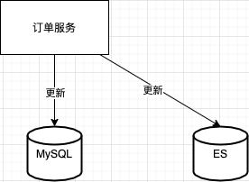
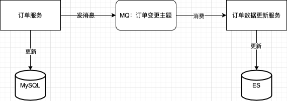
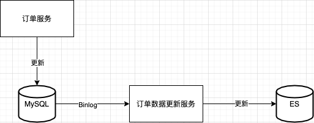
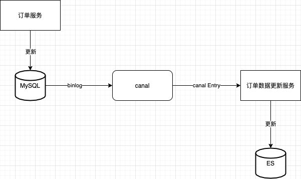
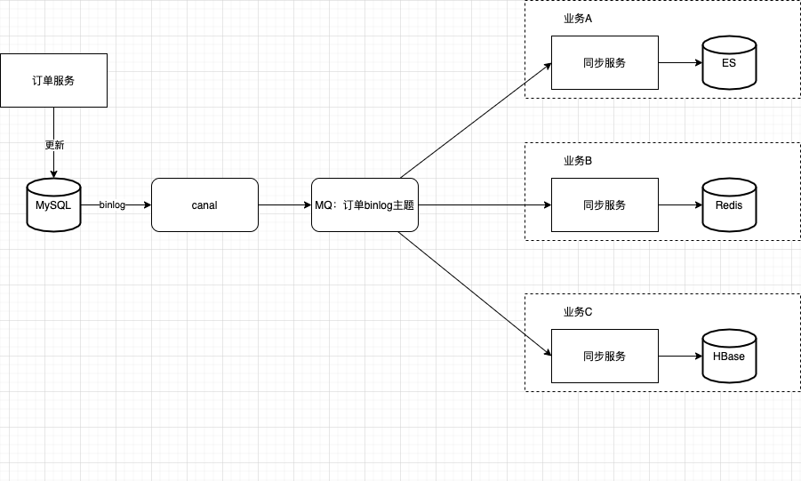

# MySQL 和 ES 数据同步方案

## 数据实时同步方案

### 同步双写

**简介**：先写 MySQL，后写 ES，用分布式事务和版本号来保证 MySQL 和 ES 的一致性

**劣势**：代码侵入性强，并且会降低下单服务的性能和可用性

* 需要改造订单服务，每一个 DAO 层接口都需要增加写入 ES 的逻辑，改造范围大
* 为了同步更新ES，需要增加分布式事务，会影响下单服务的性能
* ES 本身出现故障，写入数据失败，还会导致下单失败的问题

### MQ 异步

**简介**：数据写入 MySQL 的同时，异步写入 ES

引入 MQ 来实现异步，首先启动一个更新 ES 的服务，作为消费者订阅订单变更主题，接收订单变更的 MQ 消息后更新 ES 中的订单数据

**劣势**：

* 需要改造订单服务，每一个 DAO 层接口都需要增加给 MQ 发送消息的逻辑，改造范围大
* 为了保证消息 100% 发送到 MQ 中，还需要使用本地消息表分布式事务

### 订阅 Binlog

**简介**：负责更新 ES 的服务，会把自己伪装成 MySQL 的一个从节点，订阅 MySQL 的 Binlog，通过 Binlog 来更新ES

现在有很多开源项目都提供了订阅和解析 MySQL Binlog 的功能，比较出名的是阿里的 [canal](https://github.com/alibaba/canal) 中间件

**canal 工作原理**

* canal 模拟 MySQL slave 的交互协议，伪装自己为 MySQL slave， 向 MySQL master 发送 dump 协议
* MySQL master 收到 dump 请求，开始推送 binary log 给 slave（即 canal）
* canal 解析 binary log 对象（原始的 byte 流），将其转换为便于读取的结构化数据

**优势**：订单服务完全不用考虑如何更新 ES，不需要改造订单服务

**劣势**：下游处理数据能力慢的话会阻塞上游服务

### Binlog 和 MQ 组合

**简介**：canal 从 MySQL 收到 Binlog，并解析成结构化数据之后，直接写入 MQ 的订单 Binlog 主题中。然后每个需要同步订单数据的业务方，都会去订阅订单 Binlog 主题，解析消费后的 Binlog 数据入库，也可以做一些数据转换、过滤或计算之后入库

**优势**：

* 引入 MQ 起到一个缓冲作用，解耦上下文，防止下游服务消费不过来，从而阻塞服务
* 便于扩展，可以同时写入下游多个数据库

**劣势**：

* 对第三方组件（canal）存在一定的依赖性

### 数据的一致性保障

比如说订单的新增、修改、删除操作。同步服务执行时也需要按照新增、修改、删除操作执行，顺序不能颠倒

MySQL 主从同步 Binlog，是一个单线程的同步过程。也就是说，在从库执行 Binlog 的时候，必须按顺序执行，才能保证数据与主库是一样的

消息队列的主题也必须设置为只有一个分区（队列），只有这样才能保证数据同步过程中的 Binlog 是严格有序的

因为消息队列消费是单线程执行，如果单线程的处理速度上不去，消息就会积压越来越多

### 性能瓶颈剖析（锁 -> 顺序）

**理论分析**：以订单库为例来说明，其实并不是订单库的所有更新操作都需要严格按照顺序执行。比如，A 和 B 两个订单号不同的订单，因为两者之间完全没有任何关系，所以它们的先后顺序并不会影响数据的一致性。但是对于同一个订单，如果更新的 Binlog 执行顺序出现错乱，那么同步出来的订单数据就会出错。也就是说，我们只需要保证每个订单的更新操作日志的顺序不要错乱就行

**具体操作方法**：

首先，根据下游同步程序的消费能力，计算所需的并发量；然后将消息队列中的分区（队列）数量设置为所需的并发数；最后把相同订单号的 Binlog 路由到同一个分区（队列）中

**路由算法**：hash(订单号) % （分区）队列数量

## 历史数据迁移方案

首先启动 canal，监听 binlog 变更后发送消息到 MQ 中，作为消费者的同步服务先不启动，让消息堆积在 MQ 中；然后启动全量同步程序，把 MySQL 数据全量同步到 ES 中；最后消费 MQ 中堆积的消息，这样 ES 就和 MySQL 数据保持一致了

## 比对和补偿方案

比对和补偿方案的难点是两个随时都在变化的数据库中的数据

根据数据的更新时间进行比对。可以设置一个比对结束时间，这个比对结束时间比当前时间早一点，这样就可以避免比对当前正在写入的数据了。比对时间窗口可以配置在 nacos 中，比如只比对前一天的数据。

每次从 MySQL 中读取一个更新时间窗口内的数据，到 ES 中查询具有相同主键的数据进行比对，如果发现数据不一致，就用 MySQL 中的数据覆盖 ES 中的数据

